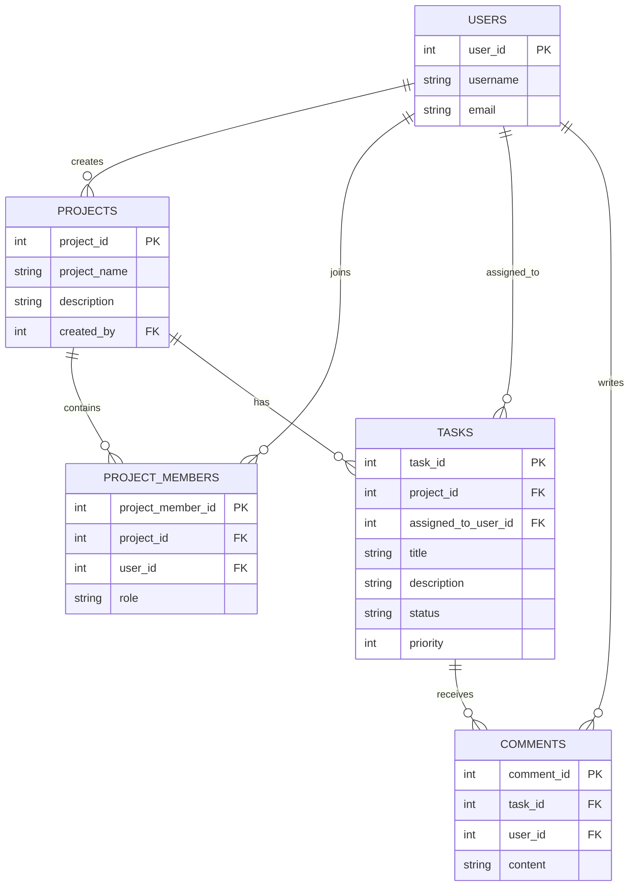

# TaskFlow - Project Management & Task Tracking REST API

TaskFlow is a backend RESTful API built with Java, Spring Boot, and MySQL. The system models multi-user collaboration across projects, team membership roles, task management, and discussions.

# Tech Stack

* Backend: Java 17+, Spring Boot 3
* Persistence & ORM: Spring Data JPA, Hibernate
* Database: MySQL
* API Documentation: Springdoc OpenAPI, Swagger UI
* Build & Dependency Management: Maven
* Testing & Tooling: Postman, Git

# System Architecture & Entity Relationship Diagram



# Implemented Modules & Features

# User Management
* Create new user accounts with username and email validation.
* Retrieve all registered users or search by user ID.
* Update user profiles and delete existing user accounts.

# Project Management
* Create workspaces tracked by a creator ID.
* Retrieve all projects or filter projects created by a specific user.
* Update project details and delete obsolete projects.

# Project Members & Collaboration
* Associate users with specific projects using assigned roles.
* Query all team members within a project.
* List all projects a specific user belongs to.
* Remove memberships when users leave a project.

# Task Management
* Create tasks mapped to existing projects and assigned team members.
* Filter tasks by project workspace.
* Update task details, priority rankings, and lifecycle statuses.
* Safe deletion of completed or canceled tasks.

# Comments & Discussions
* Thread discussion comments under specific tasks.
* Validate that referenced tasks and author users exist prior to persistence.
* Retrieve chronological comment streams per task.
* Edit or delete individual comments.

# API Endpoints Reference

# Users
* POST /api/users - Register a new user
* GET /api/users - Retrieve all users
* GET /api/users/{id} - Retrieve user by ID
* PUT /api/users/{id} - Update user details
* DELETE /api/users/{id} - Delete user

# Projects
* POST /api/projects - Create a new project
* GET /api/projects - Retrieve all projects
* GET /api/projects/{projectId} - Retrieve project by ID
* GET /api/projects/creator/{userId} - Retrieve projects created by a specific user
* PUT /api/projects/{projectId} - Update project details
* DELETE /api/projects/{projectId} - Delete project

# Project Members
* POST /api/members - Add a user to a project
* GET /api/members - View all memberships
* GET /api/members/project/{projectId} - Get all members of a project
* GET /api/members/user/{userId} - Get all projects a user belongs to
* DELETE /api/members/{projectMemberId} - Remove a user from a project

# Tasks
* POST /api/tasks - Create a task
* GET /api/tasks/{taskId} - Retrieve task by ID
* GET /api/tasks/project/{projectId} - Retrieve all tasks for a project
* PUT /api/tasks/{taskId} - Update task details
* PATCH /api/tasks/{taskId}/status - Update task status
* DELETE /api/tasks/{taskId} - Delete task

# Comments
* POST /api/comments - Add a comment to a task
* GET /api/comments/task/{taskId} - Retrieve all comments for a task
* GET /api/comments/{commentId} - Retrieve a specific comment
* PUT /api/comments/{commentId} - Update comment content
* DELETE /api/comments/{commentId} - Delete comment

# Local Setup & Installation

# Prerequisites
* Java Development Kit (JDK 17 or later)
* MySQL Server
* Apache Maven

# Database Configuration
Create a database in your local MySQL instance:

```sql
CREATE DATABASE task_flow_db;
```

Update `src/main/resources/application.properties` with your database credentials:

```properties
spring.datasource.url=jdbc:mysql://localhost:3306/task_flow_db
spring.datasource.username=root
spring.datasource.password=your_password
spring.jpa.hibernate.ddl-auto=update
spring.jpa.show-sql=true
```

# Running the Application
* Clone the repository to your local machine.
* Build and run the project using Maven:

```bash
mvn clean spring-boot:run
```

* The application starts on port 8080 by default.

# Interactive API Documentation
Access Swagger UI in your browser once the server is running:
* http://localhost:8080/swagger-ui/index.html

# Contributions
Contributions are highly encouraged and always welcome. Whether you want to fix a bug, add a new feature, or improve the documentation, your help is appreciated.

To contribute to this project:
* Fork the repository
* Create a new branch for your feature or bug fix
* Commit your changes
* Push the branch to your fork
* Open a pull request

Beginners are entirely welcome to make their first pull request here. Feel free to open an issue to discuss a proposed change or ask questions before you start working on it.
